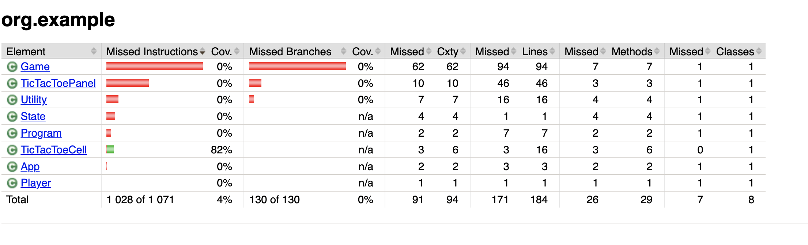

# ST-6 Модульное тестирование на Java с использованием jUnit и Maven (2)


Срок выполнения задания:

**по 04.05.2025** 


## Задание №1

Используя командную строку и утилиту **Maven** создать новый проект, используя вариант команды

```
mvn archetype:generate -DgroupId=com.mycompany.app -DartifactId=my-app -DarchetypeArtifactId=maven-archetype-quickstart -DarchetypeVersion=1.5 -DinteractiveMode=false
```

В проекте Maven, по-умолчанию, создаются тесты - заглушки.

Добавить в проект код программы **Program.java**, содержащий реализацию игры "Крестики-Нолики" с использованием минимаксного алгоритма.

Далее, построить проект и убедиться, что ошибок нет и фиктивные тесты запускаются успешно.

```
mvn compile
mvn test
```

## Задание №2

Добавить в проект модульные тесты, покрывающие основной функционал классов и методов. В этой работе упор делается не на качество самих тестов, а на их количество и процент покрытия исходного кода. 

В **pom.xml** поместить зависимость пакета для генерации отчета по покрытию:

```
<plugins>
      <plugin>
        <artifactId>maven-surefire-plugin</artifactId>
        <version>3.3.0</version>
        <configuration>
          <forkCount>1</forkCount>
          <testFailureIgnore>true</testFailureIgnore>
        </configuration>
      </plugin>
            <!-- Move JaCoCo plugin outside of pluginManagement -->
      <plugin>
        <groupId>org.jacoco</groupId>
        <artifactId>jacoco-maven-plugin</artifactId>
        <version>0.8.11</version>
        <executions>
          <execution>
            <goals>
              <goal>prepare-agent</goal>
            </goals>
          </execution>
          <execution>
            <id>report</id>
            <phase>prepare-package</phase>
            <goals>
              <goal>report</goal>
            </goals>
          </execution>
        </executions>
      </plugin>
    </plugins>
```
Вставлять зависимости нужно в раздел **build**, но вне контейнера **pluginManagement**.

Построение отчета происходит при выполнении команды

```
mvn package
```

После запуска тестов найти в разделе **target** проекта ссылку на отчет (`target/site/jacoco/index.html`) и открыть его в браузере.




В данной работе необходимо добиться покрытия минимум **70%** исходного кода (строк)
Скриншот отчета сохранить в файле `report/coverage.png` 

**Примечание**

Данный проект предполагает, что на основе присланных файлов, будет проведено исследование покрытия и полученный отчет будет сравнен с данными, отображенными на скриншоте.


